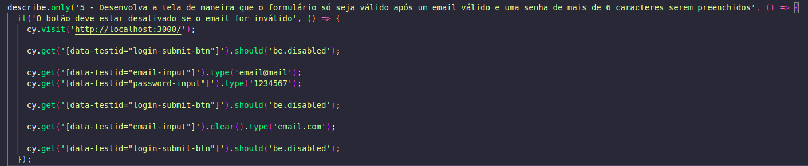
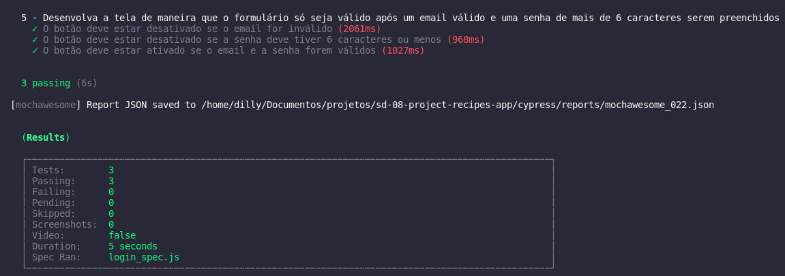
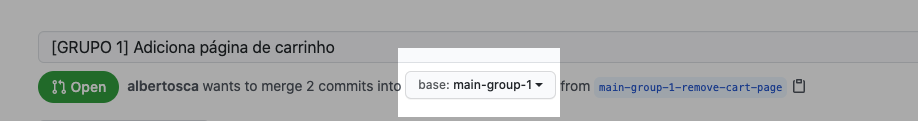

# Welcome to the Recipes App project repository!

To carry out the project, pay attention to each step described below. If you have any questions, send them to us via _Slack_! #vqv 🚀

Here, you will find details on how to structure the development of your project from this repository, using a specific branch and a _Pull Request_ to place your codes.

# Terms and agreements

By starting this project, you agree to the guidelines of Trybe's Code of Conduct and Student Handbook.

# Deliverables

<details>
   <summary><strong>🤷🏽‍♀️ How to deliver</strong></summary><br />

   To deliver your project you must create a *Pull Request* in this repository.

   Remember that you can consult our content on [Git & GitHub](https://app.betrybe.com/course/4d67f5b4-34a6-489f-a205-b6c7dc50fc16/) and our [Blog - Git & GitHub](https ://blog.betrybe.com/tecnologia/git-e-github/) whenever you need it!
</details>

<details>
   <summary><strong>👨‍💻 What should be developed</strong></summary><br />

   You will develop a recipe app, using the most modern features within the React ecosystem: Hooks and Context API!

   It will be possible to: view, search, filter, favorite and monitor the progress of preparing food and drink recipes!

   ⚠️ The database will be 2 different APIs, one for food and one for drinks.

   The layout focuses on mobile devices, so all prototypes will be developed on smaller screens.
</details>

<details>
   <summary><strong>:memo: Skills</strong></summary><br />

   In this project, you will be able to:

   - Use _Redux_ to manage state
   - Use the _React-Redux_ library
   - Use the _React_ Context API to manage state
   - Use the _React Hook useState_
   - Use the _React Hook useContext_
   - Use the _React Hook useEffect_
   - Create custom Hooks
</details>

<details>
   <summary><strong>🗓 Delivery Date</strong></summary><br />
  
   * This project is a group project;
   * There will be `9` days of project;
   * Date for final delivery of the project: `11/11/2022 14:00`.

</details><br />

# Guidelines

<details>
   <summary><strong>‼️ Before you start developing</strong></summary><br />

   1. Clone the repository

   - Use the command: `git clone git@github.com:tryber/sd-024-a-project-recipes-app.git`.
   - Go to the repository folder you just cloned:
     - `cd sd-024-a-project-recipes-app`
   - Go to your group branch:
     - `git checkout main-group-XX && git pull`, where `XX` is your group number. Examples: `main-group-1`, `main-group-22`.

   2. Install dependencies and initialize the project

   - Install dependencies:
     - `npm install`
   - Initialize the project:
     - `npm start` (a new page should open in your browser with plain text)
  
   3. Make changes separated by new branches created from the `main-group-XX` branch, creating a new branch for each demand

   - Check that you are on the `main-group-XX` branch
     - Example: `git branch`
   - If not, switch to the `main-group-XX` branch
     - Example: `git checkout main-group-XX && git pull`
   - Now, create a branch for the demand you will develop for your project
     - You must create a branch with a brief description of the demand to be developed
     - Example: `git checkout -b main-group-XX-create-search-field`

   4. Add changes to Git _stage_ and `commit`

   - Check that the changes are not yet in _stage_
     - Example: `git status` (new changes should be listed in red)
   - Add the new file to Git _stage_
     - Example:
       - `git add .` (adding all changes - _that were in red_ - to the Git stage)
       - `git status` (new changes should appear listed in green)
   - Make the `commit`
     - Example:
       - `git commit -m 'create search component'` (making the first commit)
       - `git status` (a message like _nothing to commit_ should appear)

   5. Add your branch with the new `commit` to the remote repository

   - Using the previous example: `git push -u origin main-group-XX-creates-search-field`

   6. Create a new `Pull Request` _(PR)_

   - Go to the _Pull Requests_ page of [GitHub repository](https://github.com/tryber/sd-024-a-project-recipes-app/pulls)
   - Click on the green _"New pull request"_ button
   - Click on the _"Compare"_ checkbox and choose your branch **carefully**
   - Put a title for your _Pull Request_
     - Example: _"[GROUP XX] Create search screen"_
   - Click on the green _"Create pull request"_ button
   - Add a description for the _Pull Request_ and click the green _"Create pull request"_ button
   - **Don't worry about filling out anything else for now!**
   - Go back to the [repository's _Pull Requests_ page](https://github.com/tryber/sd-024-a-project-recipes-app/pulls) and check that your _Pull Request_ is created
   
   7. Once approved by at least one person in your group and the _Linter_ is supported, access **YOUR** _Pull Request_ and click on the _"Merge pull request"_ button

</details>

<details>
   <summary><strong>⌨️ During development</strong></summary><br />

   - ⚠ **REMEMBER TO CREATE ALL FILES INSIDE THE FOLDER WITH YOUR NAME** ⚠

   - Commit changes you make to the code regularly

   - Remember to always after one (or a few) `commits` update the remote repository

   - The commands you will use most frequently are:
     1. `git status` _(to check what is in red - out of stage - and what is in green - on stage)_
     2. `git add` _(to add files to the Git stage)_
     3. `git commit` _(to create a commit with the files that are in the Git stage)_
     4. `git push -u origin branch-name` _(to push the commit to the remote repository the first time you `push` a new branch)_
     5. `git push` _(to push the commit to the remote repository after the previous step)_

</details>

<details>
   <summary><strong>🤝 After finishing development (optional)</strong></summary><br />

   To signal that your project is ready for _"Code Review"_, do the following:

   - Go to the **YOUR** _Pull Request_ page, add the _"code-review"_ label and tag your colleagues:

     - In the menu on the right, click on the _link_ **"Labels"** and choose the _label_ **code-review**;

     - In the menu on the right, click on the _link_ **"Assignees"** and choose **your username**;

     - In the menu on the right, click on the _link_ **"Reviewers"** and type `students`, select the team `tryber/students-sd-024-a`.

   If you have any questions, [here is an explanatory video](https://vimeo.com/362189205).

</details>

<details>
   <summary><strong>🕵🏿 Reviewing a pull request</strong></summary><br />

   Use the content about [Code Review](https://app.betrybe.com/course/real-life-engineer/code-review) to help you review _Pull Requests_.

</details>

<details>
   <summary><strong>🎛 Linter and Stylelint</strong></summary><br />

   We will use [ESLint](https://eslint.org/) to do static analysis of your code.

   To ensure the quality of your code so that it is more readable, easier to maintain and follows good development practices, we use the `ESLint` linter in this project. To run the linter locally in your project, run the command below:

   ```bash
   npm run lint
   npm run lint:styles
   ```

   If you still have any questions, you can consult our content on [`ESLint`](https://app.betrybe.com/course/real-life-engineer/eslint)

   **PULL REQUESTS WITH LINTER ERRORS WILL NOT BE EVALUATED. BE CAREFUL TO RESOLVE THEM BEFORE COMPLETING THE DEVELOPMENT!** ⚠

   You can also install the `ESLint` plugin in `VSCode`, just go to extensions and download the [`ESLint` plugin](https://marketplace.visualstudio.com/items?itemName=dbaeumer.vscode-eslint).
</details>

<details>
   <summary><strong>:busts_in_silhouette: Trello as a Kanban tool</strong></summary><br />

   One way for your group to organize activities and divide tasks is through a kanban model. Trybe provides a pre-configured [board for you](https://trello.com/b/RojqC6yx/app-de-receitas) to duplicate on [Trello](https://trello.com/).

   To duplicate, just follow the steps:

   - Access [board link](https://trello.com/b/RojqC6yx/app-de-receitas)
   - Open the menu in the top right corner
   - Select "copy frames"
   - Set your group team and a title for the board
   - Click `create`
   - Customize your new kanban!
</details>

<details>
   <summary><strong>🛠 Tests</strong></summary><br />

   <details><summary><strong>Running requirement tests :building_construction:</strong></summary><br />
  
   For the project to be validated, all behavioral tests must pass. You can test this locally by running `npm run cy`. This command runs the Cypress test suite that validates that the overall flow and functional requirements are working as they should. You can also run the `npm run cy:open` command to have a visual result of the tests run.

   These tests do not consider the layout in general, but rather the correct attributes and information, so pay attention to that! The tests will give you an error message if they are not passing (for whatever reason). 😉

   ⚠️ **Attention:** Your application must be running for Cypress in the terminal to be able to test.
   
   ### Tip: disabling tests

   To run just one test file, you need to use the command:

   `npm run cy -- --spec cypress/integration/login_spec.js`

   **Note**: after the "spec" you need to add the entire path to the tests file.

   To run just one test, simply use the `.only` function after `describe`. With this, it will be possible for only one requirement to run locally and be evaluated.

   
   

   > ⚠️ The automatic evaluator does not necessarily evaluate your project in the order in which the requirements appear in the readme. This is to make the evaluation process faster. So don't be alarmed if this happens, okay?
   </details>

   <details><summary><strong>Running coverage tests :open_umbrella:</strong></summary><br />
   Some requirements will ask you to develop tests for your application. These tests will be evaluated through test coverage.

   You can check the test coverage percentage with the `npm run test-coverage` command.

   You can also run `npm run test-coverage -- --collectCoverageFrom=path/of/Page` to check the percentage of test coverage for each 'Page'. For example, to check the test coverage of the `Login` page, run the command `npm run test-coverage -- --collectCoverageFrom=src/pages/Login.js`.

   </details>
</details>

<details>
   <summary><strong>:convenience_store: Development </strong></summary><br />

   * <details><summary><b> How to develop :technologist:</b></summary>

     This repository **already has a `main-group` for each group**, identified as `main-group-1` for group 1, `main-group-2` for group 2, and so on. To develop, you must always:

       * **Create your development branch from your main branch**. To do this, clone this repository, do `git checkout main-group-XX && git pull` and then `git checkout -b main-group-XX-minha-feature`.
       * To create a Pull Request to do **Code Review**, title it `[GRUPO XX] My title` and **always point your branch's Pull Request to your group's `main-group-XX` branch , as in the example below:**

     <details><summary> Example of how to point a PR to the group's main branch</summary>

       
     </details>

       * When several people develop for the same project, **merge conflicts** may occur and will need to be resolved. Pay attention to this!

       ⚠ **ATTENTION! IT IS POSSIBLE TO MAKE A MISTAKE IN ANOTHER GROUP'S BRANCH, SO BE VERY CAREFUL** ⚠

       You will see that the project requirements have, in addition to technical observations and what will be validated, descriptions such as would be seen in a real project. It is very important to be able to read descriptions like this and transform them into products or, if in doubt, know how to remove them! We remain available on Slack for this.

       This repository already contains a _template_ with a React App created, configured and with the automated tests that are part of the correction. It also has a **main-group** branch for each group, identified as `main-group-1` for group 1, `main-group-2` for group 2, and so on.

       **⚠️ Remember to write unit tests and feel free to change the prototype UI, just respect the `data-testid` attributes, they will be used to correct the exercise.**
     </details>

   * <details><summary><b> APIs :gear:</b></summary><br/>

     🚨 **IMPORTANT**

     To make requests, you must only use `fetch`!! Other libraries like Axios can cause problems with the evaluator.

     * <details><summary><b> TheMealDB API</b></summary>

       [TheMealDB](https://www.themealdb.com/) is an open, community-maintained database of recipes and ingredients from around the world.

       The end-points are quite rich, you can [see them here](https://www.themealdb.com/api.php)

       The response model for a `meal` is as follows:
         <details><summary><b>See model answer for a meal</b></summary>
         
         ```json
          {
            "meals":[
                {
                  "idMeal":"52882",
                  "strMeal":"Three Fish Pie",
                  "strDrinkAlternate":null,
                  "strCategory":"Seafood",
                  "strArea":"British",
                  "strInstructions":"Preheat the oven to 200C\/400F\/Gas 6 (180C fan).\r\nPut the potatoes into a saucepan of cold salted water. Bring up to the boil and simmer until completely tender. Drain well and then mash with the butter and milk. Add pepper and taste to check the seasoning. Add salt and more pepper if necessary.\r\nFor the fish filling, melt the butter in a saucepan, add the leeks and stir over the heat. Cover with a lid and simmer gently for 10 minutes, or until soft. Measure the flour into a small bowl. Add the wine and whisk together until smooth.\r\nAdd the milk to the leeks, bring to the boil and then add the wine mixture. Stir briskly until thickened. Season and add the parsley and fish. Stir over the heat for two minutes, then spoon into an ovenproof casserole. Scatter over the eggs. Allow to cool until firm.\r\nSpoon the mashed potatoes over the fish mixture and mark with a fork. Sprinkle with cheese.\r\nBake for 30-40 minutes, or until lightly golden-brown on top and bubbling around the edges.",
                  "strMealThumb":"https:\/\/www.themealdb.com\/images\/media\/meals\/spswqs1511558697.jpg",
                  "strTags":"Fish,Seafood,Dairy,Pie",
                  "strYoutube":"https:\/\/www.youtube.com\/watch?v=Ds1Jb8H5Sg8",
                  "strIngredient1":"Potatoes",
                  "strIngredient2":"Butter",
                  "strIngredient3":"Milk",
                  "strIngredient4":"Gruy\u00e8re",
                  "strIngredient5":"Butter",
                  "strIngredient6":"Leek",
                  "strIngredient7":"Plain Flour",
                  "strIngredient8":"White Wine",
                  "strIngredient9":"Milk",
                  "strIngredient10":"Parsley",
                  "strIngredient11":"Salmon",
                  "strIngredient12":"Haddock",
                  "strIngredient13":"Smoked Haddock",
                  "strIngredient14":"Eggs",
                  "strIngredient15":"",
                  "strIngredient16":"",
                  "strIngredient17":"",
                  "strIngredient18":"",
                  "strIngredient19":"",
                  "strIngredient20":"",
                  "strMeasure1":"1kg",
                  "strMeasure2":"Knob",
                  "strMeasure3":"Dash",
                  "strMeasure4":"50g",
                  "strMeasure5":"75g",
                  "strMeasure6":"2 sliced",
                  "strMeasure7":"75g",
                  "strMeasure8":"150ml",
                  "strMeasure9":"568ml",
                  "strMeasure10":"2 tbs chopped",
                  "strMeasure11":"250g",
                  "strMeasure12":"250g",
                  "strMeasure13":"250g",
                  "strMeasure14":"6",
                  "strMeasure15":"",
                  "strMeasure16":"",
                  "strMeasure17":"",
                  "strMeasure18":"",
                  "strMeasure19":"",
                  "strMeasure20":"",
                  "strSource":"https:\/\/www.bbc.co.uk\/food\/recipes\/three_fish_pie_58875",
                  "dateModified":null
                }
            ]
          }
        ```
      </details>
      
      The ingredients follow a logical order where its name (<code>strIngredient1</code>) and quantity (<code>strMeasure1</code>) have the same number at the end (1, in this case).

       It is possible to list all `categories`, `nationalities` (coming from the API as "areas") and `ingredients`:

       ```
       categories: https://www.themealdb.com/api/json/v1/1/list.php?c=list
       nationalities: https://www.themealdb.com/api/json/v1/1/list.php?a=list
       ingredients: https://www.themealdb.com/api/json/v1/1/list.php?i=list
       ```

       The ingredient photos come from a standardized end-point with the following logic:

       ```
       https://www.themealdb.com/images/ingredients/{ingredient-name}-Small.png
       // example with "Lime"
       https://www.themealdb.com/images/ingredients/Lime-Small.png
       ```
       </details>

     * <details><summary><b> The CockTailDB API</b></summary>
       Very similar (even maintained by the same entity) to TheMealDB API, but focused on drinks.

       The end-points are also quite rich, you can [see them here](https://www.thecocktaildb.com/api.php)

       The answers follow the same structure, with some particularities relating to drinks (such as whether or not they are alcoholic, for example)

         <details><summary><b>See model answer for drinks</b></summary>
         
         ```json
          {
            "drinks":[
                {
                  "idDrink":"17256",
                  "strDrink":"Martinez 2",
                  "strDrinkAlternate":null,
                  "strDrinkES":null,
                  "strDrinkDE":null,
                  "strDrinkFR":null,
                  "strDrinkZH-HANS":null,
                  "strDrinkZH-HANT":null,
                  "strTags":null,
                  "strVideo":null,
                  "strCategory":"Cocktail",
                  "strIBA":null,
                  "strAlcoholic":"Alcoholic",
                  "strGlass":"Cocktail glass",
                  "strInstructions":"Add all ingredients to a mixing glass and fill with ice.\r\n\r\nStir until chilled, and strain into a chilled coupe glass.",
                  "strInstructionsES":null,
                  "strInstructionsDE":"Alle Zutaten in ein Mischglas geben und mit Eis f\u00fcllen. Bis zum Abk\u00fchlen umr\u00fchren und in ein gek\u00fchltes Coup\u00e9glas abseihen.",
                  "strInstructionsFR":null,
                  "strInstructionsZH-HANS":null,
                  "strInstructionsZH-HANT":null,
                  "strDrinkThumb":"https:\/\/www.thecocktaildb.com\/images\/media\/drink\/fs6kiq1513708455.jpg",
                  "strIngredient1":"Gin",
                  "strIngredient2":"Sweet Vermouth",
                  "strIngredient3":"Maraschino Liqueur",
                  "strIngredient4":"Angostura Bitters",
                  "strIngredient5":null,
                  "strIngredient6":null,
                  "strIngredient7":null,
                  "strIngredient8":null,
                  "strIngredient9":null,
                  "strIngredient10":null,
                  "strIngredient11":null,
                  "strIngredient12":null,
                  "strIngredient13":null,
                  "strIngredient14":null,
                  "strIngredient15":null,
                  "strMeasure1":"1 1\/2 oz",
                  "strMeasure2":"1 1\/2 oz",
                  "strMeasure3":"1 tsp",
                  "strMeasure4":"2 dashes",
                  "strMeasure5":null,
                  "strMeasure6":null,
                  "strMeasure7":null,
                  "strMeasure8":null,
                  "strMeasure9":null,
                  "strMeasure10":null,
                  "strMeasure11":null,
                  "strMeasure12":null,
                  "strMeasure13":null,
                  "strMeasure14":null,
                  "strMeasure15":null,
                  "strCreativeCommonsConfirmed":"No",
                  "dateModified":"2017-12-19 18:34:15"
                }
            ]
          }
        ```
        </details>
        
        The ingredients follow a logical order where its name (<code>strIngredient1</code>) and quantity (<code>strMeasure1</code>) have the same number at the end (1, in this case).
       </details>
     </details>

   * <details><summary><b>Project Requirements :memo:</b></summary>

     The requirements are organized by screens and this time, you will define the priorities! Use wisely!

     We recommend that requirements for the same screen be done in sequence or in parallel by people who will communicate a lot so that there are no conflicts. Requirements for the same screen with equal priorities can be done in parallel, but this will require organization on the part of the people who are dividing the task to avoid conflicts.

     * Your project requirements are automatically evaluated, using a screen resolution of `360 x 640` (360 pixels wide by 640 pixels high).

         - ⚠️ Therefore, it is recommended to develop your project using the same resolution, by installing [this plugin](https://chrome.google.com/webstore/detail/window-resizer/kkelicaakdanhinjdeammmilcgefonfh?hl=en) of `Chrome` to make it easier to configure the resolution. ⚠️
     </details>

   * <details><summary><b>Technical notes :information_source:</b></summary>

     Some things must follow a pre-established pattern for patch tests to work correctly.

     ⚠️ Read them carefully and follow exactly what is asked. Failure to comply with a requirement, in whole or in part, will impact your assessment. ⚠️

     * <details><summary><b> Routes</b></summary>

       The routes to be used in the application must be the following:

       * Login screen: `/`;
       * Main screen for food recipes: `/meals`;
       * Drink recipes main screen: `/drinks`;
       * Details screen for a food recipe: `/meals/:recipe-id`;
       * Details screen for a drink recipe: `/drinks/:recipe-id`;
       * Recipe screen in food progress: `/meals/:recipe-id/in-progress`;
       * Drink recipe in progress screen: `/drinks/:recipe-id/in-progress`;
       * Profile screen: `/profile`;
       * Made recipes screen: `/done-recipes`;
       * Favorite recipes screen: `/favorite-recipes`.
       </details>
      
     * <details><summary><b> LocalStorage</b></summary>

       The use of `localStorage` is necessary so that the information is not lost if the person updates the page. The correct thing is to use the values to start your store or your context.

       In the browser's `localStorage`:

       * the `user` key must contain the following structure:
       ```js
       {
           email: person's email
       }
       ```

       * the `doneRecipes` key must contain the following structure:
       ```js
       [{
           id: recipe-id,
           type: meal-or-drink,
           nationality: nationality-of-the-recipe-or-empty-text,
           category: recipe-category-or-empty-text,
           alcoholicOrNot: alcoholic-or-non-alcoholic-or-empty-text,
           name: recipe-name,
           image: recipe-image,
           doneDate: when-the-recipe-was-completed,
           tags: recipe-tags-array-or-empty-array
       }]
       ```

       * the `favoriteRecipes` key must contain the following structure:
       ```js
       [{
           id: recipe-id,
           type: meal-or-drink,
           nationality: nationality-of-the-recipe-or-empty-text,
           category: recipe-category-or-empty-text,
           alcoholicOrNot: alcoholic-or-non-alcoholic-or-empty-text,
           name: recipe-name,
           image: recipe-image
       }]
       ```

       * the `inProgressRecipes` key must contain the following structure:
       ```js
       {
           drinks: {
               drink-id: [list-of-ingredients-used],
               ...
           },
           meals: {
               food-id: [list-of-ingredients-used],
               ...
           }
       }
       ```
       
       **Technical observations**

       * `drink-id` and `food-id` represent the ID of a drink and food, respectively, and each item in the ingredient list of the respective recipe must be represented only by the ingredient number in numeric format.
       </details>
    
     * <details><summary><b> Icons</b></summary>

       The icons to be used in the application are available in the `src/image/` directory. These icons will be used by the automated assessment tests, so make sure you use them in the requirements and do not rename them.

       The icons are:

       * `profileIcon.svg`;
       * `searchIcon.svg`;
       * `drinkIcon.svg`;
       * `mealIcon.svg`;
       * `shareIcon.svg`;
       * `whiteHeartIcon.svg`;
       * `blackHeartIcon.svg`;
       </details>

     * <details><summary><b> Library <code>clipboard-copy</code></b></summary>

       For components that contain the functionality to favorite food or drinks, you will need to use the `clipboard-copy` library to copy the recipe information. This library is already installed in the project.

       For more information, see [documentation](https://www.npmjs.com/package/clipboard-copy)
       </details>

     * <details><summary><b> <code>Bootstrap</code> library (optional)</b></summary>

       For groups that want to implement styling in the app, we recommend using the `Bootstrap` lib. It is already installed by default in this project, you just need to implement it in its components. For example, if you want to implement a [button](https://react-bootstrap.github.io/components/buttons/):

       ``` jsx
       import Button from 'react-bootstrap/Button';

       const MyComponent = () => (
         <Button variant="success">
           Green Button
         </Button>
       );
       ...
       ```

       For more information, see [documentation](https://react-bootstrap.github.io/getting-started/introduction/)
       </details>
     </details><br />
</details>

<details>
   <summary><strong>🗣 Give us feedback on the project!</strong></summary><br />

When finalizing and submitting the project, don't forget to rate your experience by filling out the form.
**Takes less than 3 minutes!**

[PROJECT EVALUATION FORM](https://be-trybe.typeform.com/to/ZTeR4IbH)

</details>

<details>
   <summary><strong>💻 Project prototype in Figma</strong></summary><br />

In addition to code quality and meeting requirements, a good layout is one of the aspects responsible for improving the usability of an application and boosting your portfolio!

You may be asking yourself: *"How do I make my project with a more attractive layout?"* 🤔

To do this, we provide this [Figma prototype](https://www.figma.com/file/9WXNFMewKRBC5ZawU1EXYG/%5BProjeto%5D%5BFrontend%5D-Recipes-App?node-id=0%3A1) to help you!

⚠️ The styling of your application will not be evaluated in this project, so this prototype is just a **suggestion** and its use is **optional**. Feel free to modify the layout and make it your own.

**⚠️ To view comments about each component, simply click the comments icon in Figma (top left).**


</details>

<details>
   <summary><strong>🗂 Share your portfolio!</strong></summary><br />

Now that you've finalized the requirements, it's time to show the world that you've learned something new! 🚀

   Follow this [**guide that we prepared with care**](https://app.betrybe.com/course/career/personal_portfolio/utilizando-projetos-feitos-na-trybe/d7ca7f50-0a8f-4b10-b360-cfcb454d832a) to make the finished project available on your personal GitHub.

In addition to keeping a back-up of your work, this step is super important to gain more visibility in the job market.

   And did you know that LinkedIn is the main professional social network and sharing your learning there is very important for anyone who wants to build a successful career? Share this project on your LinkedIn, tag Trybe's profile (@trybe) and show your network its evolution.

</details><br />

# Requirements

:warning: **PULL REQUESTS WITH LINTER ERRORS WILL NOT BE EVALUATED.** :warning:

In this project, the person using the app can search for a specific recipe, explore recipes based on different criteria, favorite and make recipes, among other features.

The screens vary depending on the type of recipe (whether it is food or drink, in this case).

***Note: The way APIs must be structured follows the following models: https://www.themealdb.com/api.php and https://www.thecocktaildb.com/api.php***

## Unitary tests

### 1 - Develop unit tests so that coverage is at least 90%
<br />
<details>
   <summary><strong>Technical observations</strong></summary>

   * In this requirement we will cover our application with unit/integration tests using the [React Testing Library](https://testing-library.com/docs/react-testing-library/intro/), take advantage of this opportunity to put it into practice [Test Driven Development](https://blog.betrybe.com/technology/tdd-test-driven-development/)

   * Remember that in Test-Driven Development, you must write the tests along with developing new features. For this reason, this requirement will only pass the evaluator as long as your application has the desired test coverage. If you add a new feature and don't create tests for it, this requirement may stop passing the evaluator.

   * The tests created by you will not influence the other requirements in the evaluator. You must develop your unit/integration tests using the React Testing Library, while the evaluator will use the [Cypress](https://docs.cypress.io/) library to evaluate the requirements, including coverage.

</details>
<br />
<details>
   <summary><strong>What will be checked</strong></summary>

   - Checks unit test coverage
</details><br />

---

## Login screen

> ⚠️ Observations:
>
> - 📁 For the tests to pass, the component must be called `Login.js`.
> - 🔗 The route used for this screen must be `/`.

### 2 - Create all elements that must respect the attributes described in the prototype for the login screen

<details>
   <summary><strong>Technical observations</strong></summary>

   * The email input must have the attribute `data-testid="email-input"`;
   * The password input must have the attribute `data-testid="password-input"`;
   * The "Enter" button must have the `data-testid="login-submit-btn"` attribute.
</details>

<br /><details>
   <summary><strong>What will be checked</strong></summary>

   - If the data-testids email-input, password-input and login-submit-btn are correct.
</details><br />

---

### 3 - Develop the screen so that the person can write their email in the email input and their password in the password input

<br /><details>
   <summary><strong>What will be checked</strong></summary>

   - The possibility of writing the email in the email input.
   - The possibility of writing the password in the password input.
</details><br />

---

### 4 - Design the screen so that the form is only valid after a valid email and a password of more than 6 characters are filled in

> This requirement also includes coverage testing of the `Login.js` page.

<br /><details>
   <summary><strong>Technical observations</strong></summary>

   * The form is only valid after a valid email and a password of more than 6 characters are filled in;
   * If the form is invalid, the submit button must be disabled, containing the `disabled` property;
   * If the form is valid, the submit button must be activated, not containing the `disabled` property.
</details>

<br /><details>
   <summary><strong>What will be checked</strong></summary>

   - The button must be disabled if the email is invalid
   - The button must be disabled if the password must be 6 characters or less
   - The button must be activated if the email and password are valid
   - Checks 45% coverage of the Login screen
</details><br />

---

### 5 - After submitting the form, save the user's email in the `user` key in localStorage

<br /><details>
   <summary><strong>Technical observations</strong></summary>

   * After submission, the user's email must be saved in `localStorage` under the `user` key in the format `{ email: email-of-the-person }`.
</details>

<br /><details>
   <summary><strong>What will be checked</strong></summary>

   - If after submission, the user key is saved in localStorage.
</details>

---

### 6 - Redirect the user to the main food recipe screen after successful login submission and validation

> This requirement also includes coverage testing of the `Login.js` page.

<br /><details>
   <summary><strong>What will be checked</strong></summary>

   - If the route switches to the main food recipes screen.
   - Checks 90% coverage of the Login screen.
</details>

---

## Header

> ⚠️ Note:
>
> - 📁 For the tests to pass, the component must be called `Header.js`.

### 7 - Implement the header according to the needs of each screen

<br /><details>
   <summary><strong>Technical observations</strong></summary>

   * The Header must have the following elements:
     * Profile icon with data-testid `profile-top-btn`, which must always be present;
     * Search icon with data-testid `search-top-btn`, which should only be present on some pages (according to the list below);
     * Title of the page with the data-testid `page-title`, which must always be present.
   * Icons can be found in `src/images/profileIcon.svg` and `src/images/searchIcon.svg`.
   * Each page must have its own title, which will be rendered by Header.
   * All routes will be checked, so create routes that have not yet been created.
</details>

<br /><details>
   <summary><strong>What will be checked</strong></summary>

   - Route "/": **does not** have a header
   - "/meals" route: has the header with the title "Meals" and the profile and search icons
   - "/drinks" route: has the header with the title "Drinks" and the profile and search icons
   - Route "/meals/:recipe-id": **doesn't have a header
   - Route "/drinks/:recipe-id": **doesn't have a header
   - Route "/meals/:id-da-receita/in-progress": **does not** have a header
   - Route "/drinks/:id-da-receita/in-progress": **doesn't have a header
   - "/profile" route: has the header with the title "Profile" and the profile icon, but **without** the search icon
   - "/done-recipes" route: has the header with the title "Done Recipes" and the profile icon, but **without** the search icon
   - "/favorite-recipes" route: has the header with the title "Favorite Recipes" and the profile icon, but **without** the search icon
</details>

---

### 8 - Redirect the user to the profile screen when clicking the profile button

> This requirement also includes coverage testing of the `Header.js` component.

<br /><details>
   <summary><strong>What will be checked</strong></summary>

   - After clicking on the profile button with the testid `profile-top-btn`, check if:
     - The route changes to the profile screen `/profile`
     - The header title changes to "Profile"
   - Checks 45% coverage of the Header component.
</details>

---

### 9 - Develop the search button that, when clicked, the search bar should appear. The same goes for hiding it

> This requirement also includes coverage testing of the `Header.js` component.

<br /><details>
   <summary><strong>Technical observations</strong></summary>
  
   * In this requirement you must only implement the logic to hide and show the search input. The functionality, among other details of the search bar, will only be implemented in requirement 10!
   * The search input that will be displayed must have the attribute `data-testid="search-input"`
</details>

<br /><details>
   <summary><strong>What will be checked</strong></summary>
  
   - If you click the search button for the first time, the search bar appears.
   - If when you click the search button a second time, the search bar disappears;
   - Checks 90% coverage of the Header component
</details>

---

## Search bar - Header

> ⚠️ Note:
>
> - 📁 For the tests to pass, the component must be called `SearchBar.js`.

### 10 - Implement the search bar elements respecting the attributes described in the prototype

<br /><details>
   <summary><strong>Technical observations</strong></summary>

   * Data-testids must exist both in the search bar and on all radio buttons.
   * The ingredient search radio button must have the attribute `data-testid="ingredient-search-radio"`;
   * The name search radio button must have the attribute `data-testid="name-search-radio"`;
   * The first letter search radio button must have the attribute `data-testid="first-letter-search-radio"`.
   * The search button must have the attribute `data-testid="exec-search-btn"`
</details>

<br /><details>
   <summary><strong>What will be checked</strong></summary>

   - If the data-testids are correct in both the search bar and all radio buttons.
</details>

---

### 11 - Implement 3 radio buttons in the search bar: Ingredient, Name and First letter

<br /><details>
   <summary><strong>Technical observations</strong></summary>

   * The search bar must have 3 _radio buttons_: `Ingredient`, `Name` and `First letter`. They, together with `search-input`, should change the way recipes will be filtered after clicking the `Search` button. The API _endpoints_ you should use can be found [here for the food API](https://www.themealdb.com/api.php) and [here for the drinks API](https://www. thecocktaildb.com/api.php).
   * If the selected radio is `Ingredient`, the API search is done correctly by the ingredient. The endpoint used must be `https://www.themealdb.com/api/json/v1/1/filter.php?i={ingrediente}`;
   * If the selected radio is `Name`, the API search is done correctly by name. The endpoint used must be `https://www.themealdb.com/api/json/v1/1/search.php?s={name}`;
   * If the selected radio is `First letter`, the API search is done correctly by the first letter. The endpoint used must be `https://www.themealdb.com/api/json/v1/1/search.php?f={primeira-letra}`;
       * If the selected radio is `First letter` and the API search is performed with more than one letter, an `alert` must be displayed with the message "Your search must have only 1 (one) character".
   * :bulb: **Example: When selecting `Ingredient` and searching for `chicken`, you must use the endpoint `https://www.themealdb.com/api/json/v1/1/filter.php?i =chicken`.**

   :bulb: **Warning:** Use `global.alert` to avoid eslint's `warnings` about the use of `alert` in the code.<br />
   :bulb: Note: For this requirement, only the main food recipe screen will be checked.
</details>

<br /><details>
   <summary><strong>What will be checked</strong></summary>

   - If the selected radio is Ingredient, the API search is done correctly by the ingredient
   - If the selected radio is Name, the API search is done correctly by name
   - If the radio selected is First letter, the API search is done correctly by the first letter
   - If the radio selected is First letter and the API search is performed with more than one letter, an alert must be displayed
</details>

---

### 12 - Search the food API if the person is on the food page, and the drinks API if they are on the drinks page

> This requirement also includes coverage tests for the `SearchBar.js` component.

<br /><details>
   <summary><strong>Technical observations</strong></summary>

   * On the drinks screen, if the radio selected is `Ingredient`, the API search is performed correctly by the ingredient. The endpoint used must be `https://www.thecocktaildb.com/api/json/v1/1/filter.php?i={ingrediente}`;
   * On the drinks screen, if the radio selected is `Name`, the API search is done correctly by name. The endpoint used must be `https://www.thecocktaildb.com/api/json/v1/1/search.php?s={name}`;
   * On the drinks screen, if the radio selected is `First letter`, the API search is performed correctly by the first letter. The endpoint used must be `https://www.thecocktaildb.com/api/json/v1/1/search.php?f={primeira-letra}`;
       * On the drinks screen, if the radio selected is `First letter` and the API search is performed with more than one letter, an `alert` must be displayed with the message "Your search must have only 1 (one) character ".

   :bulb: **Warning:** Use `global.alert` to avoid eslint's `warnings` about the use of `alert` in the code.<br />
   :bulb: Note: For this requirement, only the main screen for drink recipes will be checked, as the food recipe screen has already been checked in the previous requirement.
</details>

<br /><details>
   <summary><strong>What will be checked</strong></summary>

   - On the drinks screen, if the radio selected is Ingredient, the API search is performed correctly by the ingredient
   - On the drinks screen, if the radio selected is Name, the API search is done correctly by name
   - On the drinks screen, if the radio selected is First letter, the API search is performed correctly by the first letter
   - On the drinks screen, if the radio selected is First letter and the API search is performed with more than one letter, an alert must be displayed
   - Checks 45% coverage of the SearchBar component
</details>

---

### 13 - Redirect to the recipe details screen if only one recipe is found, with its ID in the URL

<br /><details>
   <summary><strong>Technical observations</strong></summary>

   * If only one food is found, you must go to its details route (`/meals/:recipe-id`);
   * If only one drink is found, you must go to its details route (`/drinks/:recipe-id`).
</details>

<br /><details>
   <summary><strong>What will be checked</strong></summary>

   - If only one food is found, you must go to its details route.
   - If only one drink is found, go to its details route.
</details>

---

### 14 - If the search returns more than one recipe, render the first 12 found, displaying the image and name of each one

<br /><details>
   <summary><strong>Technical observations</strong></summary>

   * Display the first 12 recipes returned by the search.
   * If the search returns fewer than 12 recipes, display all of them.
   * Each recipe must be displayed in an element that contains its information.
   * Display the image and name of each recipe.
   * The element containing each recipe must have `data-testid="${index}-recipe-card"`.
   * The image of each recipe must contain `data-testid="${index}-card-img"`.
   * The tag with the name of each recipe must have `data-testid="${index}-card-name"`.
</details>

<br /><details>
   <summary><strong>What will be checked</strong></summary>

   - If more than one food is found, show the first 12.
   - If more than one drink is found, show the first 12.
</details>

---

### 15 - Display an `alert` if no recipe is found

> This requirement also includes coverage tests for the `SearchBar.js` component.

<br /><details>
   <summary><strong>Technical observations</strong></summary>

   * The alert must contain the text "Sorry, we haven't found any recipes for these filters."

   :bulb: **Warning:** Use `global.alert` to avoid eslint's `warnings` about the use of `alert` in the code.<br />
</details>

<br /><details>
   <summary><strong>What will be checked</strong></summary>

   - If no food is found, the alert should be displayed.
   - If no drink is found, the alert should be displayed.
   - Checks 90% coverage of the SearchBar component.
</details>

---

## Bottom menu

> ⚠️ Note:
>
> - 📁 For the tests to pass, the component must be called `Footer.js`.

### 16 - Implement the bottom menu by positioning it in a fixed way and containing 2 icons: one for food and one for drinks

> This requirement also includes coverage testing of the `Footer.js` component.
  
<br /><details>
   <summary><strong>Technical observations</strong></summary>

   * All necessary icons are available in the `src/images` folder;
   * The bottom menu must have the `data-testid="footer"` attribute;
   * The element that leads to the drinks page must use the icon `drinkIcon.svg` and have the attribute `data-testid="drinks-bottom-btn"`;
   * The element that leads to the food page must use the icon `mealIcon.svg` and have the attribute `data-testid="meals-bottom-btn"`;
   * The bottom menu must always be fixed at the end of the page.
</details>
<br /><details>
   <summary><strong>What will be checked</strong></summary>

   - Whether the bottom menu exists and contains the correct icons
   - If the bottom menu is always fixed to the end of the page.
   - Checks 45% coverage of the Footer component.
</details>

---

### 17 - Display the bottom menu only on the screens indicated by the prototype

<br /><details>
   <summary><strong>Technical observations</strong></summary>

* All routes will be checked, so create routes that have not yet been created.
</details>

<br /><details>
   <summary><strong>What will be checked</strong></summary>

   - Route "/": **not** must have a footer
   - Route "/meals": must have footer
   - Route "/drinks": must have a footer
   - Route "/meals/:recipe-id": **not** must have a footer
   - Route "/drinks/:recipe-id": **not** must have a footer
   - Route "/meals/:id-da-receita/in-progress": **not** must have a footer
   - Route "/drinks/:id-da-receita/in-progress": **not** must have a footer
   - Route "/profile": must have footer
   - Route "/done-recipes": **not** should have a footer
   - Route "/favorite-recipes": **not** must have a footer
</details>

---
### 18 - Redirect the user to the correct screen by clicking on each icon in the bottom menu

> This requirement also includes coverage testing of the `Footer.js` component.

<br /><details>
   <summary><strong>What will be checked</strong></summary>

- If there is redirection to the drinks list when clicking on the drinks icon;
- If there is redirection to the list of foods when clicking on the food icon;
- Checks 90% coverage of the Footer component.
</details>

---

## Main recipe screen

> ⚠️ Observations:
>
> - 📁 For the tests to pass, the component must be called `Recipes.js`.
> - 🔗 The routes used for this screen must be `/meals` and `/drinks`.

:bulb: **Tip:** remember to componentize the React elements very well on this screen, thus avoiding logic and complexity problems ;).

### 19 - Upload the first 12 food or drink recipes, one on each card

<br /><details>
   <summary><strong>Technical observations</strong></summary>

   * Recipes must be loaded when starting the page.
   * If the recipes are for food, you must load the first 12 recipes obtained through the endpoint `https://www.themealdb.com/api/json/v1/1/search.php?s=`
   * If the recipes are for drinks, you must load the first 12 recipes obtained through the endpoint `https://www.thecocktaildb.com/api/json/v1/1/search.php?s=`
   * The card must have `data-testid="${index}-recipe-card"`
   * The photo (`strMealThumb` or `strDrinkThumb`) must have `data-testid="${index}-card-img"`
   * The name (`strMeal` or `strDrink`) must have `data-testid="${index}-card-name"`
</details>

<br /><details>
   <summary><strong>What will be checked</strong></summary>

- The screen has the data-testids of all 12 cards on the food screen
- If the recipes are for food, you must upload the first 12 recipes
- The screen has the data-testids of all 12 cards on the drinks screen
- If the recipes are for drinks, you must upload the first 12 recipes
</details>

---


### 20 - Implement category buttons to be used as a filter

> This requirement also includes coverage testing of the `Recipes.js` page.

<details>
   <summary><strong>Technical observations</strong></summary>

   * Each button must contain the prefixed attribute `data-testid=${categoryName}-category-filter` and only the first 5 categories returned from the API must be displayed.
   * If the recipes are for food, the first 5 food categories obtained through the endpoint `https://www.themealdb.com/api/json/v1/1/list.php?c=list` must be displayed ;
   * If the recipes are drinks, the first 5 drink categories obtained through the endpoint `https://www.thecocktaildb.com/api/json/v1/1/list.php?c=list` must be displayed .
</details>
<br /><details>
   <summary><strong>What will be checked</strong></summary>

- If the recipes are for food, the first 5 food categories must be displayed
- If the recipes are drinks, the first 5 drink categories must be displayed
- Checks 45% coverage of the Recipes screen
</details>

---

### 21 - Implement the recipe filter through the API when clicking on the category filter

<br /><details>
   <summary><strong>Technical observations</strong></summary>

   * Recipes, filtered by categories, must be obtained through the [foods](https://www.themealdb.com/api.php) or [drinks](https://www.thecocktaildb.com/api) API .php). The `Filter by Category` endpoints must be used for both APIs.
   * On the food screen, if the selected category is `Beef`, the endpoint used will be `https://www.themealdb.com/api/json/v1/1/filter.php?c=Beef`
   * On the drinks screen, if the selected category is `Cocktail` the endpoint used will be `https://www.thecocktaildb.com/api/json/v1/1/filter.php?c=Cocktail`
   * In addition to the categories provided by the API, we will also add a button that should clear the filters, returning all recipes again. This button must have the text **"All"** and the attribute `data-testid="All-category-filter"`.
   * If the category returns only one result, **NOT** redirection to the details page should be done.
</details>

<br /><details>
   <summary><strong>What will be checked</strong></summary>

   - If the recipes are food and the category is "Beef", you must upload the first 12 recipes from the "Beef" category
   - If the recipes are for food and the category is "Breakfast", you must upload the first 12 recipes from the "Breakfast" category
   - If the recipes are food and the category is "Chicken", you must upload the first 12 recipes from the "Chicken" category
   - If the recipes are for food and the category is "Dessert", you must upload the first 12 recipes from the "Dessert" category
   - If the recipes are for food and the category is "Goat", you must load the first 12 recipes from the "Goat" category
   - If the recipes are drinks and the category is "Ordinary Drink", you must upload the first 12 recipes from the "Ordinary Drink" category
   - If the recipes are drinks and the category is "Cocktail", you must upload the first 12 recipes from the "Cocktail" category
   - If the recipes are drinks and the category is "Shake", you must upload the first 12 recipes from the "Shake" category
   - If the recipes are drinks and the category is "Other/Unknown", you must upload the first 12 recipes from the "Other/Unknown" category
   - If the recipes are drinks and the category is "Cocoa", you must upload the first 12 recipes from the "Cocoa" category
   - If the recipes are for food, there must be an option called "All" that clears the category filters
   - If the recipes are for drinks, there must be an option called "All" that clears the category filters
</details>

---

### 22 - Implement the filter as a toggle, which if selected again, the app should return the recipes without any filter

<br /><details>
   <summary><strong>What will be checked</strong></summary>

   - If the recipes are for food and the filter is selected again, the first 12 recipes without filter must be returned.
   - If the recipes are drinks and the filter is selected again, the first 12 recipes without a filter must be returned.
</details>

---

### 23 - Redirect the user by clicking on the card to the details screen, which must change the route and contain the recipe ID in the URL

  > This requirement also includes coverage testing of the `Recipes.js` page.

<br /><details>
   <summary><strong>Technical observations</strong></summary>

   * If the recipe is for a food, the person must be redirected to the route `/meals/:id-da-receita`
   * If the recipe is for a drink, the person must be redirected to the route `/drinks/:id-da-receita`
</details>

<br /><details>
   <summary><strong>What will be checked</strong></summary>

   - If the recipes are for food, the route must change to the recipe details screen
   - If the recipes are for drinks, the route must change to the recipe details screen
   - Checks 90% coverage of the Recipes screen
</details>

---

## Recipe details screen

> ⚠️ Observations:
>
> - 📁 For the tests to pass, the component must be called `RecipeDetails.js`.
> - 🔗 The routes used for this screen must be `/meals/:id-da-receita` and `/drinks/:id-da-receita`.

:bulb: **Tip:** remember to componentize the React elements very well on this screen, thus avoiding logic and complexity problems ;).


### 24 - Make a request to the API passing the `id` of the recipe which must be available in the URL parameters

<details>
   <summary><strong>Technical observations</strong></summary>

   * To check whether the request to the food API was made, the endpoint used must be `https://www.themealdb.com/api/json/v1/1/lookup.php?i={id-da-receita }`;
   * To check whether the request to the drinks API was made, the endpoint used must be `https://www.thecocktaildb.com/api/json/v1/1/lookup.php?i={id-da-receita }`.
</details>

<br /><details>
   <summary><strong>What will be checked</strong></summary>
   - If the request to the food API was made.
   - If the request for the drinks API was made.
</details>

---

### 25 - Develop the screen so that it contains an image of the recipe, the title, the category in the case of food and whether or not it is alcoholic in the case of drinks, a list of ingredients followed by quantities, instructions, a video of the embedded youtube and recommendations

<details>
   <summary><strong>Technical observations</strong></summary>

   Verification will be done using the recipes returned by the API, such as: the text of the ingredients and instructions, using the data-testids attributes:

   * The photo must have the attribute `data-testid="recipe-photo"`;
   * The title must have the attribute `data-testid="recipe-title"`;
   * The category text must have the attribute `data-testid="recipe-category"`;
   * Ingredients must have the attribute `data-testid="${index}-ingredient-name-and-measure"`;
   * The instruction text must have the `data-testid="instructions"` attribute;
   * The video, present only on the food screen, must have the attribute `data-testid="video"`;
  
   Remember: YouTube video should only be available for food recipes, as it is not returned by the [Drinks API](https://www.thecocktaildb.com/api.php).
  
   :bulb: Tip: Do a search on `how to embed youtube video` and see some search suggestions to help you build the code.

</details>
<br /><details>
   <summary><strong>What will be checked</strong></summary>

   - Whether the food screen has all data-testid attributes
   - Whether the drinks screen has all data-testid attributes
</details>

---

### 26 - Implement the recommendations. For food recipes, the recommendation must be drink, while for drink recipes the recommendation must be food

<details>
   <summary><strong>Technical observations</strong></summary>

   * You must make requests to the food and beverage APIs, and store the data, which will be used later in requirement 27 to generate recommendations.
   * On the food page, make a request to the drinks API, the endpoint used must be `https://www.thecocktaildb.com/api/json/v1/1/search.php?s=`;
   * On the drinks page, make a request to the food API, the endpoint used must be `https://www.themealdb.com/api/json/v1/1/search.php?s=`.
</details>
<br /><details>
   <summary><strong>What will be checked</strong></summary>

   - If the request for the drinks API was made on the food page.
   - If the request for the food API was made on the drinks page.
</details>

---

### 27 - Implement the 6 recommendation cards, showing only 2. The scroll is horizontal, similar to a `carousel`

<details>
   <summary><strong>Technical observations</strong></summary>

   * Render only the 6 recommended recipes;
     * Only 2 recipes must be visible, with a horizontal scroll, similar to a `carousel`
   * The recommended recipe card must have the attribute `data-testid="${index}-recommendation-card"`;
     * Within the card, the name of the recommended recipe must have the attribute `data-testid="${index}-recommendation-title"`;
</details>
<br /><details>
   <summary><strong>What will be checked</strong></summary>

   - If only two recommendations are visible on the screen at a time;
   - If the carousel scrolls horizontally;
   - Whether there are all 6 recommendations in the details screen of a food
   - Whether all 6 recommendations exist in the details screen of a drink
</details>

---

### 28 - Develop a button called "Start Recipe" that should remain fixed at the bottom of the screen at all times

<br /><details>
   <summary><strong>Technical observations</strong></summary>

   * The start recipe button must have the attribute `data-testid="start-recipe-btn"`;
</details>

<br /><details>
   <summary><strong>What will be checked</strong></summary>

   - If the button has the data-testid attribute.
   - The positioning of the button on the food details screen.
   - The positioning of the button on the drink details screen.
</details>

---

### 29 - Implement the solution so that, if the recipe has already been made, the "Start Recipe" button disappears
> This requirement also includes coverage testing of the `RecipeDetails.js` page.

<br /><details>
   <summary><strong>Technical observations</strong></summary>

   * Remember that previously `finished` recipes are saved in the `doneRecipes` key as indicated in the localStorage session.
       * The `doneRecipes` key will only be populated by the application when the "Finish Recipe" button is implemented, but it is not necessary to implement the button for this requirement to pass the evaluator!
       * If the "Finish Recipe" button is not yet implemented, you can use as a basis the structure of the `doneRecipes` key that is informed in the `Development > Technical observations > LocalStorage` section of the readme.
       * You can use the evaluator itself to test how it works, but you can also manually populate the `doneRecipes` key and test manually.
</details>

<br /><details>
   <summary><strong>What will be checked</strong></summary>

   - If the start recipe button is not visible on the details screen of a food.
   - If the start recipe button is not visible on the details screen of a drink.
   - Checks coverage of 45% of the details screen of a recipe.
</details>

---

### 30 - Implement the solution so that, if the recipe has been started but not finished, the button text should be "Continue Recipe"

<br /><details>
   <summary><strong>Technical observations</strong></summary>

   * Remember that previously `started` recipes are saved in the `inProgressRecipes` key as indicated in the localStorage session.
       * The `inProgressRecipes` key will only be populated by the application in requirement `40`, but it is not necessary to implement requirement `40` for this requirement to pass the evaluator!
       * If requirement `40` is not yet implemented, you can use as a basis the `inProgressRecipes` key structure that is informed in the `Development > Technical Notes > LocalStorage` section of the readme.
       * You can test the operation with the evaluator itself and you can also manually populate the `inProgressRecipes` key to test manually.
</details>

<br /><details>
   <summary><strong>What will be checked</strong></summary>

   - The "Continue Recipe" button on the food details screen.
   - The "Continue Recipe" button on a drink's details screen.
</details>

---

### 31 - Redirect the user if the "Start Recipe" button is clicked, the route should change to the recipe in progress screen

<br /><details>
   <summary><strong>What will be checked</strong></summary>

   - Redirects to the drink recipe screen in progress.
   - Redirects to the recipe screen for the food in progress.
</details>

---

### 32 - Implement a share button and a favorite button for the recipe

<br /><details>
   <summary><strong>Technical observations</strong></summary>

   * The share button must have the `data-testid="share-btn"` attribute;
   * The favorite button must have the attribute `data-testid="favorite-btn"`;
</details>

<br /><details>
   <summary><strong>What will be checked</strong></summary>

   - Whether the buttons are available on the food details screen.
   - Whether buttons are available on a drink's details screen.
</details>

---
### 33 - Implement the solution so that, when clicking the share button, the recipe details link should be copied to the clipboard and a message warning that the link has been copied should appear on the screen in an HTML tag

<br /><details>
   <summary><strong>Technical observations</strong></summary>

   * The evaluator will not take into account the messages displayed by `global.alert`, you must display it in the html.
   * The share button icon can be found in `src/images/shareIcon.svg`.
   * For this requirement you will need to use the clipboard-copy library. For more information, see the [library documentation](https://www.npmjs.com/package/clipboard-copy).
</details>

<br /><details>
   <summary><strong>What will be checked</strong></summary>

   - If the message "Link copied!" appears on the screen within an HTML tag and the food recipe details link has been copied to the clipboard.
   - If the message "Link copied!" appears on the screen within an HTML tag and whether the drink recipe details link has been copied to the clipboard.
</details>

---

### 34 - Save favorite recipes to `localStorage` in the `favoriteRecipes` key

<br /><details>
   <summary><strong>Technical observations</strong></summary>

   * Remember that previously `favorite` recipes are saved in the `favoriteRecipes` key as indicated in the localStorage section.
   * Favorite recipes must be saved in `localStorage` in the `favoriteRecipes` key in the format `[{ id, type, nationality, category, alcoholicOrNot, name, image }]`.
</details>


<br /><details>
   <summary><strong>What will be checked</strong></summary>

   - Checks that after you favorite a food recipe, it is saved correctly in localStorage
   - Checks if after favorite a drink recipe, it is saved correctly in localStorage
</details>

---

### 35 - Implement the heart icon (favorite) so that: it must be filled in if the recipe is favorited and empty otherwise

<br /><details>
   <summary><strong>Technical observations</strong></summary>

   * Button icons can be found in `src/images/whiteHeartIcon.svg` and `src/images/blackHeartIcon.svg` respectively.
</details>

<br /><details>
   <summary><strong>What will be checked</strong></summary>

   - If your favorite food comes with a full heart.
   - If the non-favorite food comes with an empty heart.
   - If your favorite drink comes with a full heart.
   - If the non-favorite drink comes with an empty heart.
</details>

---

### 36 - Implement logic in the favorite button. If clicked, the heart icon should change its current state, if it is filled it should change to empty and vice versa

> This requirement also includes coverage testing of the `RecipeDetails.js` page.

<br /><details>
   <summary><strong>What will be checked</strong></summary>

   - Favorite food
   - Disfavors food
   - Favorite drink
   - Disfavors the drink
   - Checks coverage of 90% of the details screen of a recipe
</details>

---


## Recipe in progress screen

> ⚠️ Observations:
>
> - 📁 For the tests to pass, the component must be called `RecipeInProgress.js`.
> - 🔗 The routes used for this screen must be `/meals/:id-da-receita/in-progress` and `/drinks/:id-da-receita/in-progress`.

:bulb: **Tip:** remember to componentize the React elements very well on this screen, thus avoiding logic and complexity problems ;).

### 37 - Develop the screen so that it contains an image of the recipe, the title, the category in the case of food and whether or not it is alcoholic in the case of drinks, a list of ingredients with their respective quantities and instructions

<details>
   <summary><strong>Technical observations</strong></summary>

   Checks if the data-testid attributes are present on the screen:

   * The photo must have the attribute `data-testid="recipe-photo"`;
   * The title must have the attribute `data-testid="recipe-title"`;
   * The share button must have the `data-testid="share-btn"` attribute;
   * The favorite button must have the attribute `data-testid="favorite-btn"`;
   * The category text must have the attribute `data-testid="recipe-category"`;
   * The instructions element must have the `data-testid="instructions"` attribute;
   * The button to finish the recipe must have the attribute `data-testid="finish-recipe-btn"`.
</details>

<br /><details>
   <summary><strong>What will be checked</strong></summary>

   - The elements of a food recipe.
   - The elements of a drink recipe.
</details>

---

### 38 - Develop a checkbox for each item on the ingredients list

<br /><details>
   <summary><strong>Technical observations</strong></summary>
   Checks whether the data-testid attributes are present on the screen with their respective quantities:
  
   * Ingredients must be displayed on a label;
     * Each label must have the attribute `data-testid=${index}-ingredient-step`
     * Within each label there must be an input box.
</details>

<br /><details>
   <summary><strong>What will be checked</strong></summary>

   - Whether all ingredients are being displayed correctly.
   - Whether each ingredient in a food/drink recipe has a checkbox.
</details>

---

### 39 - Implement logic that when clicking on an ingredient's checkbox, its name must be "crossed out" from the list

> This requirement also includes coverage testing of the `RecipeInProgress.js` page.

<br /><details>
   <summary><strong>Technical observations</strong></summary>
  
   * When clicking on the checkbox, the item must be crossed out, thus showing that this step has been completed.
     * `text-decoration: line-through solid rgb(0, 0, 0)`
</details>

<br /><details>
   <summary><strong>What will be checked</strong></summary>

   - Whether it is possible to mark all the steps of the food recipe.
   - Whether it is possible to mark all the steps of the drink recipe.
   - Checks 45% coverage of the recipe screen in progress.
</details>

---

### 40 - Save the progress status, which must be maintained if the person refreshes the page or returns to the same recipe

<br /><details>
   <summary><strong>Technical observations</strong></summary>
  
   * After clicking the checkbox on one of the recipe ingredients, it is expected that the ingredient will remain marked after the page reloads. To do this, develop the verification logic according to the `inProgressRecipes` key in localStorage.
</details>

<br /><details>
   <summary><strong>What will be checked</strong></summary>

   - The progress of a food recipe in progress is saved.
   - The progress of a drink recipe in progress is saved.
</details>

---

### 41 - Develop the logic for favorites and sharing. The logic of a recipe details screen applies here

<br /><details>
   <summary><strong>What will be checked</strong></summary>

   - Whether the buttons are available on the food details screen.
   - Whether buttons are available on a drink's details screen.
   - The message "Link copied!" and whether the food recipe link was copied to the clipboard.
   - Check the message "Link copied!" and whether the drink recipe link was copied to the clipboard.
   - Check favorite food.
   - Check unfavorite food.
   - Check favorite drink.
   - Check non-favorite drink.
   - Favorite food.
   - Disfavors food.
   - Favorite drink.
   - Disfavorite drink.
   - Favorite food recipe.
   - Favorite drink recipe.
</details>

---
### 42 - Implement the solution so that the finish recipe button ("Finish Recipe") can only be enabled when all ingredients are _"checked"_ (marked)

<br /><details>
   <summary><strong>Technical observations</strong></summary>
  
   * The button must be disabled until all checkboxes are checked.
   * The button must remain fixed at the bottom of the screen at all times, similar to the "Start Recipe" button.
</details>

<br /><details>
   <summary><strong>What will be checked</strong></summary>

   - If the finish button is disabled in food recipes.
   - If the finish button is disabled in drink recipes.
   - If the finish button is enabled in food recipes.
   - Whether the button to finish is enabled in drink recipes.
</details>

---

### 43 - Redirect the user after clicking the finish recipe button ("Finish Recipe"), to the made recipes page, whose route must be `/done-recipes`
 
> This requirement also includes coverage testing of the `RecipeInProgress.js` page.

<br /><details>
   <summary><strong>What will be checked</strong></summary>

   - Redirects itself after completing a food recipe.
   - Redirects itself after completing a drink recipe.
   - If the recipe is added to localStorage, in the `doneRecipes` key, when the "Finish Recipe" button is clicked.
   - Checks 90% coverage of the recipe screen in progress.
</details>

---

## Made recipes screen

> ⚠️ Observations:
>
> - 📁 For the tests to pass, the component must be called `DoneRecipes.js`.
> - 🔗 The route used for this screen must be `/done-recipes`.

### 44 - Implement the elements of the recipe screen made respecting the attributes described in the prototype

<br /><details>
   <summary><strong>Technical observations</strong></summary>

   > Note: Remember that the recipes made are saved in `localStorage` in the `doneRecipes` key, read the `localStorage` section for more details.

   * All data-testids are present:
     * The `All` filter button must have the `data-testid="filter-by-all-btn"` attribute;
     * The `Meals` filter button must have the `data-testid="filter-by-meal-btn"` attribute;
     * The `Drinks` button must have the `data-testid="filter-by-drink-btn"` attribute;
     * The recipe card image must have the attribute `data-testid="${index}-horizontal-image"`;
     * The recipe category text must have the attribute `data-testid="${index}-horizontal-top-text"`;
     * The text of the recipe name must have the attribute `data-testid="${index}-horizontal-name"`;
     * The text of the date the recipe was made must have the attribute `data-testid="${index}-horizontal-done-date"`;
     * The recipe sharing element must have the attribute `data-testid="${index}-horizontal-share-btn"`;
     * Recipe tags must have the attribute `data-testid=${index}-${tagName}-horizontal-tag`;
</details>
<br /><details>
   <summary><strong>What will be checked</strong></summary>

   - Whether all data-testids are available.
</details>

---

### 45 - Develop the screen so that, if the card recipe is a food, it must have: the photo of the recipe, name, category, nationality, the date the person made the recipe, the first 2 tags returned by the API and a share button

<br /><details>
   <summary><strong>Technical observations</strong></summary>

   * Nationality and category must be displayed in the element with the `data-testid="${index}-horizontal-top-text"` attribute.
     * The text must be in this format: `${nationality} - ${category}`
   * The share button icon can be found in `src/images/shareIcon.svg`.
</details>

<br /><details>
   <summary><strong>What will be checked</strong></summary>

   - If the card has the attributes of a food:
     - photo of the recipe;
     - name;
     - category and nationality;
     - the date the recipe was made;
     - 2 first tags returned by the API;
     - share button.
</details>

---

### 46 - Develop the screen so that, if the card recipe is a drink, it must have: the photo of the recipe, the name, whether it is alcoholic, the date on which the person made the recipe and a button to share

> This requirement also includes coverage testing of the `DoneRecipes.js` page.

<br /><details>
   <summary><strong>Technical observations</strong></summary>
  
   * Information about whether the drink is alcoholic must be displayed in the element with the attribute `data-testid="${index}-horizontal-top-text"`.
   * The share button icon can be found in `src/images/shareIcon.svg`.
</details>

<br /><details>
   <summary><strong>What will be checked</strong></summary>

   - If the card has the correct attributes of a drink:
     - photo of the recipe;
     - name;
     - if you are alcoholic;
     - the date the recipe was made;
     - share button.
   - Checks coverage of 45% of the Recipes Made Screen
</details>

---

### 47 - Design the solution so that the share button should copy the URL from the recipe details screen to the clipboard

<br /><details>
   <summary><strong>What will be checked</strong></summary>

   - When you click on the share button, the message "Link copied!" should appear;
   - Whether the recipe details screen URL is copied to the clipboard.
</details>

---

### 48 - Implement 2 buttons that filter recipes by food or drink and a third that removes all filters

<br /><details>
   <summary><strong>Technical observations</strong></summary>

   * Button names should be "Meals", "Drinks" and "All", respectively.
   * When clicking on the "Meals" button, recipes must be filtered by food;
   * When clicking on the "Drinks" button, recipes must be filtered by drinks;
   * When clicking the "All" button, the filter must be removed.
</details>
<br /><details>
   <summary><strong>What will be checked</strong></summary>

   - If you click on the "Meals" button, the recipes are filtered by food;
   - If you click on the "Drinks" button, the recipes are filtered by drinks;
   - If you click on the "All" button, the filter is removed.
</details>

---

### 49 - Redirect to the recipe details screen if the photo or recipe name is clicked

> This requirement also includes coverage testing of the `DoneRecipes.js` page.

<br /><details>
   <summary><strong>What will be checked</strong></summary>

   - If you click on the photo of the recipe, the route changes to the details screen for that recipe;
   - If you click on the name of the recipe, the route changes to the details screen for that recipe;
   - Checks coverage of 90% of the made recipes screen.
</details>

---

## Favorite recipes screen

> ⚠️ Observations:
>
> - 📁 For the tests to pass, the component must be called `FavoriteRecipes.js`.
> - 🔗 The route used for this screen must be `/favorite-recipes`.

### 50 - Implement the elements of the favorite recipes screen (cumulative with the attributes in common with the made recipes screen), respecting the attributes described in the prototype

<br /><details>
   <summary><strong>Technical observations</strong></summary>

   > Note: Remember that the recipes made are saved in `localStorage` in the `favoriteRecipes` key, read the `localStorage` section for more details.

     * All data-testids are present:
     * The `All` filter button must have the `data-testid="filter-by-all-btn"` attribute;
     * The `Meals` filter button must have the `data-testid="filter-by-meal-btn"` attribute;
     * The `Drinks` button must have the `data-testid="filter-by-drink-btn"` attribute;
     * The recipe card image must have the attribute `data-testid="${index}-horizontal-image"`;
     * The recipe category text must have the attribute `data-testid="${index}-horizontal-top-text"`;
     * The text of the recipe name must have the attribute `data-testid="${index}-horizontal-name"`;
     * The recipe sharing element must have the attribute `data-testid="${index}-horizontal-share-btn"`;
     * The recipe favorite element must have the attribute `data-testid="${index}-horizontal-favorite-btn"`;
     
     </details>


<br /><details>
   <summary><strong>What will be checked</strong></summary>

   - Whether all data-testids are available.
</details>

---

### 51 - Develop the screen so that, if the card's recipe is a food, it must have: the photo of the recipe, name, category, nationality, a share button and a "unfavorite" button

<br /><details>
   <summary><strong>Technical observations</strong></summary>
  
   * Nationality and category must be displayed in the element with the `data-testid="${index}-horizontal-top-text"` attribute.
     * The text must be in this format: `${nationality} - ${category}`
   * Button icons can be found in `src/images/shareIcon.svg` and `src/images/blackHeartIcon.svg` respectively.
</details>

<br /><details>
   <summary><strong>What will be checked</strong></summary>

   - If the card has the attributes of a food:
     - photo of the recipe;
     - name;
     - category and nationality;
     - share button;
     - favorite button.
</details>

---

### 52 - Develop the screen so that, if the card recipe is a drink, it must have: the photo of the recipe, name, whether it is alcoholic or not, a share button and a "unfavorite" button

> This requirement also includes coverage testing of the `FavoriteRecipes.js` page.

<br /><details>
   <summary><strong>Technical observations</strong></summary>
  
   * Information about whether the drink is alcoholic must be displayed in the element with the attribute `data-testid="${index}-horizontal-top-text"`.
   * Button icons can be found in `src/images/shareIcon.svg` and `src/images/blackHeartIcon.svg` respectively.
</details>

<br /><details>
   <summary><strong>What will be checked</strong></summary>

   - If the card has the correct attributes of a drink:
     - photo of the recipe;
     - name;
     - if you are alcoholic;
     - share button;
     - favorite button.
   - Checks 45% coverage of the favorite recipes screen.
</details>

---

### 53 - Design the solution so that the share button should copy the URL from the recipe details screen to the clipboard

<br /><details>
   <summary><strong>What will be checked</strong></summary>

   - If when you click on the share button, the message "Link copied!" appears;
   - Whether the recipe details screen URL is copied to the clipboard.
</details>

---

### 54 - Design the solution so that the "unfavorite" button should remove the recipe from the list of favorite recipes in `localStorage` and from the screen

<br /><details>
   <summary><strong>What will be checked</strong></summary>

   - If you click on the "unfavorite" button, the respective recipe is removed from the screen.
   - If you click on the "unfavorite" button, the respective recipe is removed from `localStorage`.
</details>

---

### 55 - Implement 2 buttons that filter recipes by food or drink and a third that removes all filters

<br /><details>
   <summary><strong>Technical observations</strong></summary>
  
   *Button names should be "Meals", "Drinks" and "All" respectively
</details>

<br /><details>
   <summary><strong>What will be checked</strong></summary>

   - If you click on the "Meals" button, the recipes must be filtered by food;
   - If you click on the "Drinks" button, the recipes must be filtered by drinks;
   - If clicking on the "All" button, the filter must be removed.
</details>

---

### 56 - Redirect the user when clicking on the photo or name of the recipe, the route should change to the details screen for that recipe

> This requirement also includes coverage testing of the `FavoriteRecipes.js` page.

<br /><details>
   <summary><strong>What will be checked</strong></summary>

   - When clicking on the photo of the recipe, the route should change to the details screen for that recipe;
   - When clicking on the name of the recipe, the route should change to the details screen for that recipe.
   - Checks 90% coverage of the Favorite Recipes Screen.
</details>

---


## Profile screen

> ⚠️ Observations:
>
> - 📁 For the tests to pass, the component must be called `Profile.js`.
> - 🔗 The route used for this screen must be `/profile`.

### 57 - Implement the profile screen elements respecting the attributes described in the prototype

<br /><details>
   <summary><strong>Technical observations</strong></summary>

   * The email element must have the `data-testid="profile-email"` attribute;
   * The button for "Done Recipes" must have the attribute `data-testid="profile-done-btn"`;
   * The button for "Favorite Recipes" must have the attribute `data-testid="profile-favorite-btn"`;
   * The "Logout" button must have the `data-testid="profile-logout-btn"` attribute.
</details>

<br /><details>
   <summary><strong>What will be checked</strong></summary>

   - All data-testid of the email and all buttons.
</details>

---

### 58 - Implement the solution so that the user's email must be visible
  
<br /><details>
   <summary><strong>What will be checked</strong></summary>

   - Whether the email stored in localStorage is visible.
</details>

---

### 59 - Implement 3 buttons: one named "Done Recipes", one named "Favorite Recipes" and one named "Logout"

<br /><details>
   <summary><strong>What will be checked</strong></summary>

   - If the screen contains all 3 buttons.
</details>

---

### 60 - Redirect the user that, when clicking on the "Done Recipes" button, the route should change to the made recipes screen

> This requirement also includes coverage tests for the `Profile.js` component.

<br /><details>
   <summary><strong>What will be checked</strong></summary>

   - Redirects itself to the correct route.
   - Verifies 45% coverage of the Profile component.
</details>

---

### 61 - Redirect the user that, when clicking on the "Favorite Recipes" button, the route should change to the favorite recipes screen

<br /><details>
   <summary><strong>What will be checked</strong></summary>

   - Redirects itself to the correct route.
</details>

---

### 62 - Redirect the user that when clicking on the "Logout" button, the `localStorage` must be cleared and the route must change to the login screen

> This requirement also includes coverage tests for the `Profile.js` component.

<br /><details>
   <summary><strong>What will be checked</strong></summary>

   - All localStorage keys are cleared;
   - If the route changes to the login screen.
   - Verifies 90% coverage of the Profile component.
</details>
